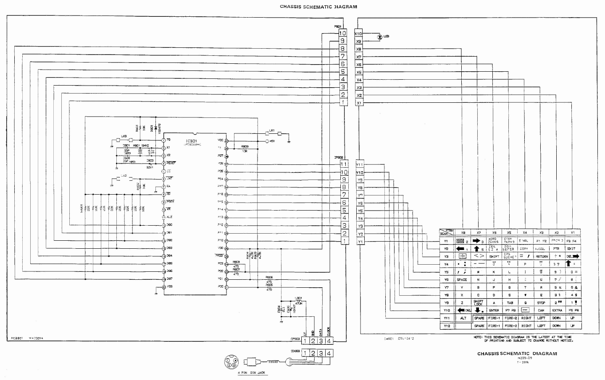
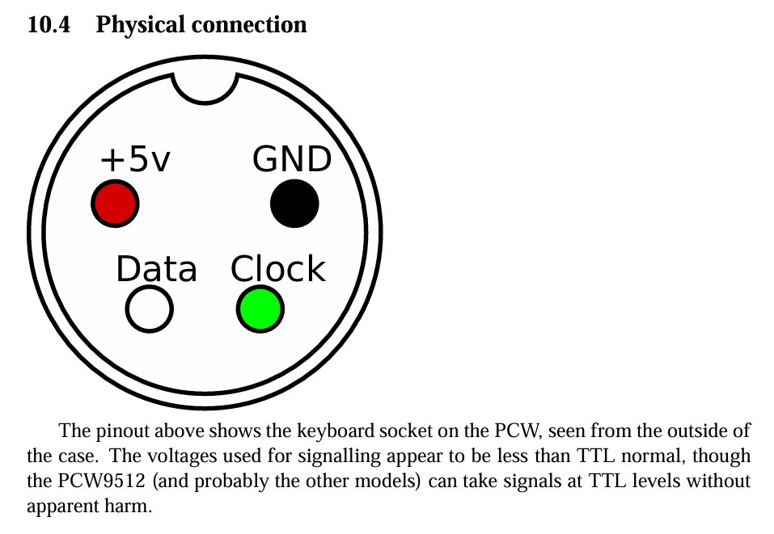
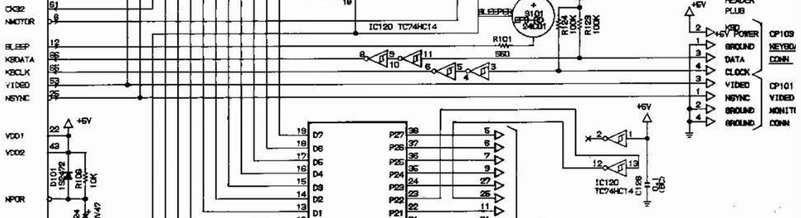
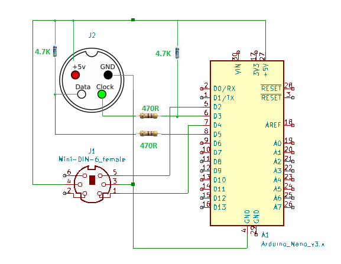
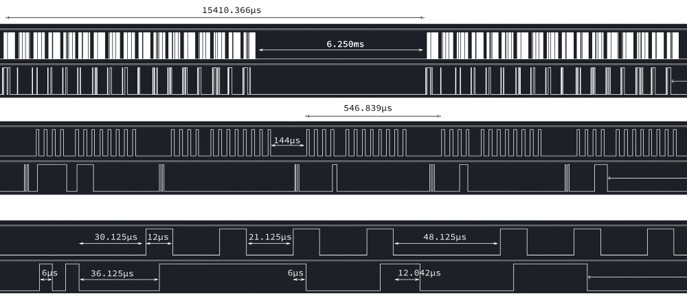

# Amstrad PCW8256 PS/2 Keyboard Emulator

This project is an in-development keyboard emulator for the Amstrad PCW8256.
An Arduino Nano reads make and break events from a PS/2 keyboard, maintains a
representation of the PCW keyboard matrix, and simulates the original Amstrad
PCW keyboard.

The Arduino continuously transmits PCW keyboard matrix/state frames to the
PCW8256 through the original keyboard clock and data interface. The target
machine for this firmware is the Amstrad PCW8256.

The active firmware is:

`PCW8256_PS2_Keyboard_Emulator/PCW8256_PS2_Keyboard_Emulator.ino`

The firmware uses the
[PS2KeyAdvanced](https://github.com/techpaul/PS2KeyAdvanced) Arduino library.

## Hardware

The current firmware targets an Arduino Nano with an ATmega328P running at
16 MHz. The pin assignments are documented at the top of the active firmware
source.

Verify connector pinout, voltage, current capacity, and common ground before
connecting the Arduino, PS/2 keyboard, or PCW8256. The emulator is still in
development and should be tested carefully.

PS/2 keyboard socket (female, front view):

## Testing

`KEYTEST.COM` is included as a CP/M diagnostic utility for PCW-side testing.
It displays the keyboard state bytes visible to the PCW8256 at memory addresses
`BFF0h-BFFFh`. This helps verify whether the PCW is receiving keyboard state
updates from the emulator.

The repository includes `CPM_14_keyboard.dsk`, a CP/M disk image containing the
diagnostic utility. The diagnostic can also be rebuilt and inserted by running
`build_keytest.bat` on Windows.

## Development Status

The transmitter and PS/2 key path have been validated with a logic analyser
(1 MHz timing capture, VCD export decoded offline). Confirmed working:

- **Clock waveform** — per bit ~12 µs high / ~21 µs low, with one high pulse
  per 12-bit word omitted so the real CLK holds low for an extended (~54 µs)
  merged low, matching the real keyboard's skipped pulse.
- **Frame structure** — 17 words per frame, offset nibbles run
  `F, 0, 1, … , E, F` with no slippage; transmitting flag (bit 7 of byte 0xF)
  set on the first word and clear on the last; update-toggle (bit 6 of 0xF)
  alternates every frame; link-status byte 0xD reads `0x80` (LK1 not fitted).
- **Inter-frame gap** — ~6.25 ms.
- **DATA/CLK alignment** — DATA is stable across each bit and latched on the
  CLK falling edge; decoding DATA against the clock recovers each word cleanly.
- **End-to-end key path** — pressing `A` (PS/2) sets byte 0x08 bit 5 (`0x20`)
  in the transmitted frame and clears it on release, with all other bytes
  unchanged. This exercises the full chain: PS/2 make/break → key map → matrix
  → frame build → ISR bit-bang → correctly framed PCW output.

Logic-analyser capture of one frame (WORD0 highlighted) and the start-of-frame
detail used to verify DATA/CLK alignment:

Diagnostic build flags at the top of the firmware select the run mode
(`DIAG_FULL_EMULATOR` for normal operation, `DIAG_PS2_ONLY` to dump decoded
PS/2 keys to serial, `DIAG_PCW_OUTPUT_ONLY` to transmit an idle frame,
`DIAG_CLK_TIMING_TEST` for a bare clock toggle) plus isolation toggles
(`DIAG_DISABLE_WORD_SKIP`, `DIAG_FORCE_DATA_LOW`, `DIAG_DISABLE_TIMER0_IRQ`)
and `PCW_INVERT_CLK` for physical clock polarity. A D6 diagnostic pin mirrors
the clock without the per-word skip, as a uniform reference for scope/analyser
comparison.

### Open items

- **Not yet tested against a real PCW.** `KEYTEST.COM` on actual hardware is
  needed to confirm `PCW_INVERT_CLK` polarity is electrically correct (the
  analyser alone can't distinguish a real inversion from a probe/channel
  setting) and that the ~54 µs merged low is accepted by the gate array.
- **~32 ms transmit pause on key events.** Each PS/2 make/break coincides with
  the transmitter stalling for ~32 ms (about five frames) before resuming
  mid-frame where it left off. No bits are lost and it is likely harmless, but
  the cause (something blocking the transmitter ISR during key handling) is not
  yet understood.

## Tools

- `pasmo.exe` is included for Windows builds of `KEYTEST.COM`.
- `iDSK.exe` version 0.20 is included for updating the CP/M disk image.

## Credits

- Original fork base: [somhi/AmstradXTPS2](https://github.com/somhi/AmstradXTPS2)
- [Pasmo Z80 assembler](https://pasmo.speccy.org/)
- [iDSK 0.20](https://github.com/cpcsdk/idsk)

## Notes from John Elliots PCW Hardware Guide
PDF:
https://www.seasip.info/Unix/Joyce/hardware.pdf
HTML:
https://www.seasip.info/Unix/Joyce/pcwkbd.html

Revisiions by James Ols
https://hackaday.io/project/27549-the-pcw-project/log/70757-keyboard-timings

# Hardware

Both keyboards use the same controller: an 8048, part number 40027.

# PCW Keyboard

Keyboard matrix from the PCW9512 service manual:

The keyboard appears as a memory-mapped device at 3FF0h–3FFFh in memory block 3.

Using the key numbering scheme in the PCW manual:

- Keys 0–71 correspond to bit (n mod 8) of byte (n / 8) of the map.
- Key 72 corresponds to bit 7 of byte 9.
- Keys 73–80 correspond to bits 0–7 of byte 10.

The entries marked J1 and J2 are for keyboard joysticks. The PCW keyboard has no joystick sockets, but the controller leaves space for them in the keyboard matrix.

Memory-map key layout (byte/bit of each key):

Bits 5-0 of the last four bytes (0xC-0xF) are for keyboard joysticks — sets of keys that could be used directionally. The assignments correspond to the joystick entries; so bit 0 is up, bit 1 is down and so on.

The W / A / D / X keyboard joystick is only available if link LK2 is connected.

Bit 6 of byte 0xD returns the state of the Shift Lock LED. This is controlled by the keyboard and cannot be set by the PCW.
The status of the three option links is reported in the top two bits of bytes 0xD and 0xE. However, if LK1 is present, the keyboard enters a self-test mode, so in normal use bit 6 of byte 0xE will never be set. For some reason the state of LK2 is inverted, so on a stock keyboard with this link disconnected, the corresponding status bit is 1.

Bit 7 of byte 0xF is set when the keyboard is transmitting data to the host, reset when it is scanning the keys. This is the reason why a keyboard data packet is 17 bytes; the first byte sets bit 7 of byte 0xF, and the last byte resets it.

Bit 6 of byte 0xF is toggled each time the keyboard transmits its state.

The last four bytes contain controller status in bits 6 and 7. Bits 0–5 of each byte are used (by analogy with the two joystick entries) to provide keyboard combinations that may be useful as joysticks.

## Controller Status Bytes

Memory-mapped control/status matrix (bytes 0xC–0xF):

### 3FFCh

3FFCh gives an inverted T pattern centred on F1.

### 3FFDh

3FFDh maps to the numeric keypad.

Bit 6 reports the state of the Shift Lock LED:
- 1 if lit
- 0 if not lit

Bit 7:
- 0 if LK2 is present
- 1 if LK2 is not present

### 3FFEh

3FFEh maps:

- ASDFGHJ = Up
- ZXCVBNM = Down
- QEO[L<,/ = Left
- WRP];>/2 = Right
- Space = Fire 1
- Shift = Fire 2

Bit 6:
- 1 if LK1 is present
- 0 if not present

Bit 7:
- 1 if LK3 is present
- 0 if not present

### 3FFFh

3FFFh maps:

 - HJKL,;<> = Up
 - BNM,./2 = Down
 - QEO\[ADZC = Left
 - WRP\[SFXV = Right
 - Space = Fire 1
 - Shift = Fire 2

Bit 6 toggles with each update from the keyboard to the PCW.

Bit 7:
- 1 if the keyboard is currently transmitting its state to the PCW
- 0 if it is scanning its keys

## No Keyboard Present

If no keyboard is present, all 16 bytes of the memory map are zero.

## 10.2 Keyboard Links
The keyboard has three option links. By default they are all disconnected. 

LK1: If connected, puts the keyboard into a test mode in which it repeatedly sends various patterns of test data to the PCW. The Shift Lock LED will be constantly lit (or, more accurately, blinking faster than you can see).

LK2: If connected, pressing Shift does not cancel Shift Lock. Also enables W/A/D/X joystick, and resets bit 7 of byte 3FFDh.
LK3: If connected, sets bit 7 of byte 3FFEh. Has no other effects.

## 10.3 Keyboard Joystick(s)
The key numbering scheme on the PCW exactly matches the memory map until the gap at key 72. It also exactly matches the keyboard matrix schematic in the PCW9512 service manual- until key 72.

The keyboard schematic has entries in its matrix table for one or two joysticks. (Existing PCWs have no provision for connecting a joystick to the
keyboard, but the PC1512 does)

## 10.4 Physical connection
The pinout above shows the keyboard socket on the PCW, seen from the outside of the case. The voltages used for signalling appear to be less than TTL normal, though the PCW9512 (and probably the other models) can take signals at TTL levels without apparent harm

## 10.4.1 Hardware connection

By default, the data and clock lines are high on the motherboard (confirmed via scope). Although they are pulled high on the PCW motherboard, they are actually driven low most of the time (by the keyboard when it is active)

Verifying the circuit diagrams: Confirmed that DATA and CLK signals go into a TC74HC14 (schmit trigger inverter) twice. Effectively inverting the signal and then reversing the signal, acting as a buffer. Both signals have a 100K pullup to 5VCC, explaining the internal pull up on the PCW.

On the keyboard side, the CLK and DATA lines enter via 470 ohm resistors, which are then pulled up to 5VCC by 4.7K ohm resistors. Internally the PCW has protection diodes to ground on both lines.

Emulator wiring (Arduino Nano to the PCW keyboard connector, with series and pull-up resistors):

## 10.4.2 Clock signal 
From James:

Clock pulses note that there's only a 21µs gap between most clock pulses, although there is a 48µs gap after the fourth clock pulse.

The data signal is valid on the back-end of the clock signal, not at the start. (Although since his clock signal is inverted, it is actually correct that it is valid on the falling edge of the clock!)

Assumption:
So long as the clock signal is within certain tolerances I would guess that the gate array just clocks the signal in on the falling edge of the clock.

To send a bit, the keyboard drives the data line low or high, pulls the clock line low, and then a little later returns them both to high. 

Notes:
PCW motherboard seems happy to accept timings similar to those used by the PC1512 keyboard (set data, wait for 5µs, set clock, wait for 5µs, return both lines to high, wait for 40µs).

## 10.4.2 Wire protocol
Unlike a PC keyboard, the PCW keyboard does not send scancodes. Instead, it repeatedly sends the entire keyboard state: 17 words of 12 bits each

A keycode is 12 bits long, with the most significant bit first. The first four bits are the offset in the memory map (0-0Fh), and the last eight bits are the value to be placed into memory at that address. The PCW keyboard toggles the DATA line twice before sending each word, but the gate array at the PCW end doesn’t seem to need this.

1. Full keyboard state is 17 words; 
2. When transmitting its state, the controller sends a 17-keycode (word) packet representing the full keyboard state
3. First word word is byte 0Fh with the top bit set to 1;
4. Next words are bytes 0-0Eh;
5. Last words is byte 0Fh with the top bit set to 0.

